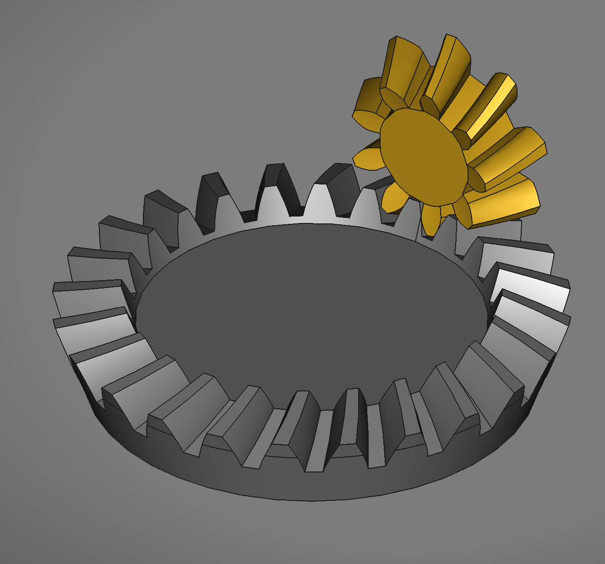

# Freecad-Bevel-Gear-Example

An example sketch for bevel gears in freecad. All values can be changed in the spreadsheet. The sketch in the body GearsetValues can help understand how all the values fit togther.

You'll need the freecad.gears workbench to adjust the gears.

The editable parameters in the spreadsheet are:

    Module:           Size of the gear teeth
    Tooth Engagement: The length of the teeth along the radius left after the cut operation
    Beta:             How much the gear teeth speen
    Number of teeth:  The number of teeth on the gear
    Final Diameter:   The final diameter of the main gear after the cut operation.
